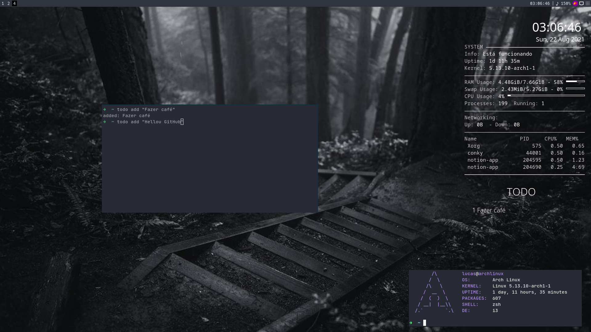

# Dotfiles

# Passos iniciais 

**Programas obrigatórios:** 

    pacman -S picom feh rofi flameshot pcmanfm kitty/alacritty

**Fontes:**

    git clone https://github.com/powerline/fonts.git
    cd fonts
    ./install

Com um gerenciador AUR instale
` yay -S siji-git noto-fonts-emoji ttf-fira-code ttf-jetbrains-mono`

Caso utilize o TO-DO
https://github.com/lucascipriano/todo.conky

